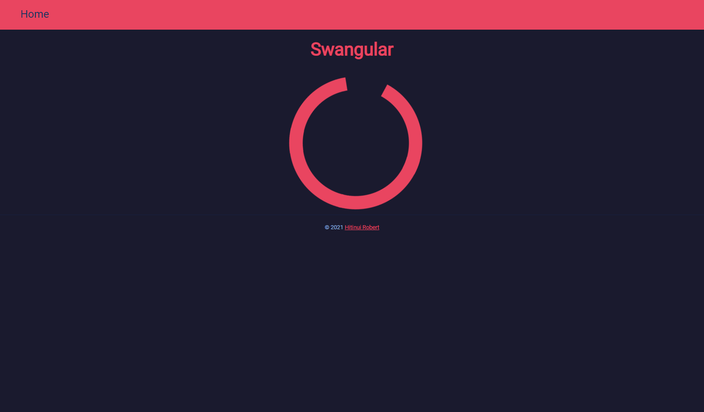
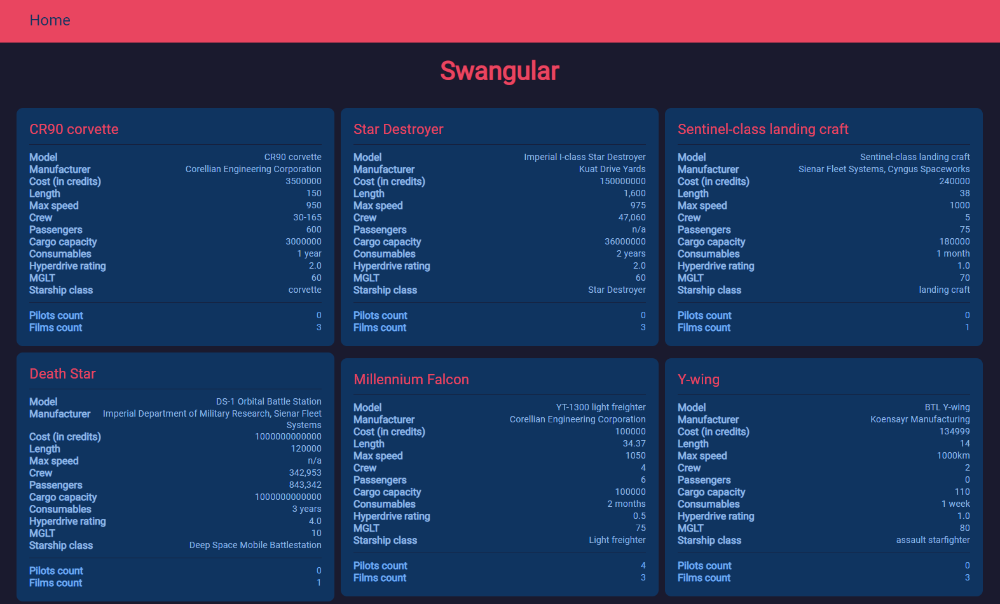
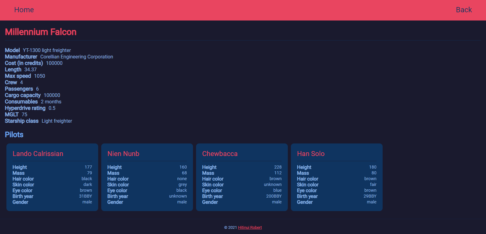
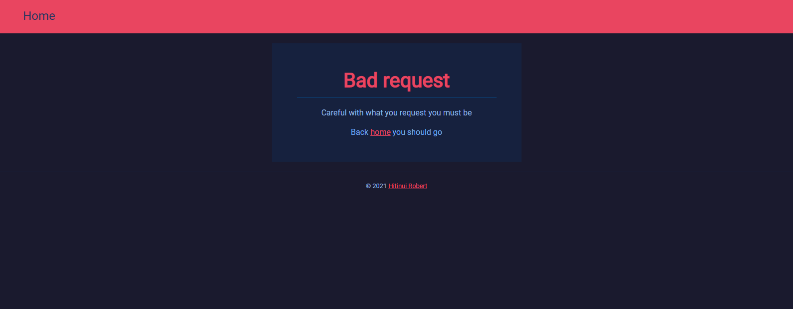

<!-- TITLE -->
<div align="center">
  <p>
    
  </p>
  <h1>Swangular</h1>
  <p>
    Demo project for <a href="https://halfserious.com/">HalfSerious</a>
  </p>
  <p>
    Angular app that allows users to navigate the different Star Wars starships and pilots.<br />
    Data is retrieved from <a href="https://swapi.dev/">SWAPI</a>.
  </p>

  <p>
    <b>
      <a href="https://swangular.imaohi.com/" target="_blank">
        » View Live Demo «
      </a>
    </b>
  </p>
</div>

<!-- FEATURES -->
## ⭐ Features
- Users can see the list of all Star Wars starships on the landing page with
  a summary of the specifications for each of them.
- Users can click on a starship card to show the details of the starship,
  including the list of the pilots.
- Users can click on a listed pilot in the starship details to show the
  pilot details.
- Users can come back to the landing page at any time by clicking on the
  *Home* link in the nav bar.

## 🛠 Installation
Assuming that you have recent versions of
<a href="https://nodejs.org/">node</a> and the
<a href="https://github.com/angular/angular-cli">Angular CLI</a>
installed, follow these steps to run the app locally in dev mode:

1. Clone or download this repository
   ```
   git clone git@github.com:hrobert/swapi-angular.git        # ssh
   # or
   git clone https://github.com/hrobert/swapi-angular        # http
   ```
2. Navigate to the project directory
   ```
   cd swapi-angular
   ```
3. Build and serve the app
   ```
   ng serve
   ```
3. Open a browser and visit <a href="http://localhost:4200/">http://localhost:4200/</a>

## 📷 Screenshots

<p></p>
<p></p>
<p></p>
<p></p>
